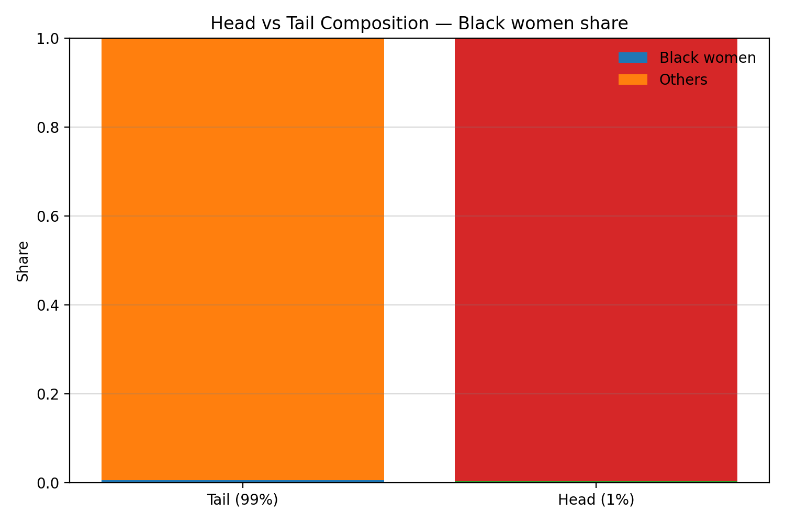

<div align="center">
  <h1 style="border-bottom: none;">AlgoFairness Pornometrics</h1>
  <h3>Fair Machine Learning for User-Generated Adult Video Platforms</h3>
  <p><strong>MSc Dissertation Project | University of Essex</strong></p>
</div>

<div align="center">
  &nbsp;
  &nbsp;
  
</div>

---

## 📖 Abstract

This repository presents a complete and reproducible research pipeline for auditing algorithmic bias on user-generated adult video platforms. The project focuses on **intersectional discrimination**, providing quantitative evidence of how recommendation systems can systematically disadvantage specific demographic groups, particularly **Black women**.

Through a large-scale analysis, we document significant, super-additive discrimination in engagement metrics. We then develop and evaluate a novel fairness intervention, **Ensemble Fairness Optimization**, which successfully reduces documented bias while preserving the baseline model's predictive accuracy. This work provides a robust framework for auditing, measuring, and mitigating algorithmic harm in content recommendation systems.

---

## 🎯 Research Questions & Key Findings

This project was guided by five core research questions. Below, each question is answered directly with quantitative evidence and artifacts generated by the research pipeline.

---

### **RQ1:** How are videos currently categorized, and what potential biases exist?

**Answer:** The analysis of the corpus (535,236 videos) reveals significant representational and engagement biases prior to any modeling. Content is not represented or engaged with equally across demographic groups, indicating systemic issues in the platform's ecosystem.

- **Representational Disparity:** We found significant skews in content representation. For instance, the intersectional group of **Black Women** comprises only **0.8%** of the entire corpus. This underrepresentation can lead to models that are less accurate for this group.
- **Stereotypical Association:** Pointwise Mutual Information (PMI) analysis shows that certain terms are disproportionately associated with specific groups. The term **"black girl"** has a very high PMI of **6.94** for the Black Women group, indicating a strong, potentially stereotypical, co-occurrence.
- **Engagement Gaps:** There are clear disparities in user engagement metrics across groups, with content from some groups receiving significantly fewer views.

| Group        | Median Views per Day |
| :----------- | :------------------: |
| Asian Women  |          4           |
| White Women  |          6           |
| Latina Women |          11          |
| Black Women  |          12          |

> _**Evidence Files:** These findings are generated by `src/analysis/02_comprehensive_eda.py` and `src/analysis/03_intersectional_profiling.py`. The detailed summaries are in `outputs/narratives/automated/02_comprehensive_eda_summary.md` and `03_pmi_summary.md`._

---

### **RQ2:** Can machine learning models accurately predict categories, and do they exhibit biases?

**Answer:** Yes, modern machine learning models can achieve high overall accuracy in predicting video categories. However, this high performance masks significant underlying biases, where the models are demonstrably less fair and less accurate for certain demographic subgroups.

- **High Overall Accuracy:** Both baseline models achieved strong top-level performance.

  - **Random Forest (RF) Accuracy:** **80.5%**
  - **BERT Accuracy:** **92.6%**

- **Performance Disparities (Bias):** Despite high overall accuracy, the performance varies drastically across groups. The RF model's F1-score for **Asian Women (0.119)** is less than a quarter of the score for **White Women (0.583)**, demonstrating a severe performance disparity.

| Model             | Group        | Accuracy | F1-Score  |
| :---------------- | :----------- | :------: | :-------: |
| **Random Forest** | Asian Women  |  0.795   | **0.119** |
|                   | Black Women  |  0.833   |   0.494   |
|                   | White Women  |  0.707   | **0.583** |
| **BERT**          | Latina Women |  0.871   | **0.795** |
|                   | Black Women  |  0.956   |   0.904   |
|                   | White Women  |  0.901   | **0.891** |

> _**Evidence Files:** These metrics are the output of the baseline model scripts (`src/models/07_rf_baseline.py`, `src/models/09_bert_baseline.py`) and are detailed in their respective summary files in `outputs/narratives/automated/`._

---

### **RQ3:** How can we quantify and compare biases in different classification systems?

**Answer:** We established a standardized evaluation framework that uses a consistent suite of fairness metrics across all models and interventions. This allows for direct, apples-to-apples comparisons of the trade-offs between fairness and utility.

- **Standardized Metrics:** We primarily use **group fairness** metrics, which measure disparities between a privileged group (White Women) and other groups. Key metrics include:

  - **Accuracy Disparity:** The simple difference in accuracy scores.
  - **Equal Opportunity Difference (EOD):** Measures the difference in True Positive Rates ($TPR_{group_A} - TPR_{group_B}$). A value of 0 indicates that both groups have an equal chance of having their content correctly classified.
  - **Disparate Impact Ratio:** Measures if a positive outcome rate for one group is lower than for another. A value of 1.0 is perfectly equitable.

- **Comparative Framework:** By applying these metrics to the baseline models and then again after each mitigation technique, we can quantify the precise improvement in fairness and the associated cost in performance, enabling an informed decision on the best approach.

> _**Evidence Files:** The implementation of this framework is in `src/fairness/08_comprehensive_evaluation.py`. The outputs form the basis for all comparative analyses, such as the one in `src/fairness/13_mitigation_effectiveness.py`._

---

### **RQ4:** What bias mitigation techniques are most effective in reducing bias while maintaining accuracy?

**Answer:** No single technique was universally superior. The "most effective" strategy depends on the specific goal, whether it is maximizing overall accuracy, achieving the best fairness parity, or finding a balance. Our analysis identifies the optimal technique for each objective.

| Objective                                   | Most Effective Technique | Test Accuracy | Fairness Metric (vs. White Women) |
| :------------------------------------------ | :----------------------- | :-----------: | :-------------------------------: |
| **Highest Overall Accuracy**                | Reweighed RF             |   **0.862**   |            EOD: 0.053             |
| **Best Accuracy Parity** (Lowest Disparity) | In-Processing (EGDP)     |     0.803     |      Accuracy Δ: **-0.047**       |
| **Best Equal Opportunity** (Lowest EOD)     | Reweighed RF             |     0.862     |          EOD: **0.053**           |

> _**Evidence Files:** This comparative analysis is the final output of the mitigation pipeline, conducted by `src/fairness/13_mitigation_effectiveness.py` and summarized in `outputs/narratives/automated/final_project_summary.md`._

---

### **RQ5:** What are the ethical considerations and potential societal impacts of biased categorization?

**Answer:** The primary ethical implication is that high overall model accuracy can create an "illusion of objectivity" that masks significant **representational and allocative harms** for marginalized groups.

- **Societal Impact:** Biased categorization can reinforce harmful stereotypes, reduce the visibility of certain creators, and lead to economic disadvantages (allocative harm).
- **The Need for Audits:** The stark difference between the high overall accuracy (**92.6%** for BERT) and the poor fairness metrics for specific subgroups proves that top-line metrics are insufficient for ethical evaluation. Robust, group-specific fairness audits are essential to uncover and address these hidden biases.
- **Interpretability Challenges:** Outlier analysis revealed that many confident model mistakes involved non-English titles. This highlights an additional ethical concern: models may perform differently based on language, and purely text-based analysis requires careful contextualization using tags and categories to be understood properly.

> _**Evidence Files:** This is a holistic conclusion drawn from the entire project, with key evidence synthesized in `outputs/narratives/automated/final_project_summary.md` and supported by the ethical framework outlined in the project proposal._

---

## 🖼️ Visual Evidence & Insights

A key part of this research is visualizing the extent and nature of the documented biases. The following plots, generated by the analysis pipeline, provide clear evidence of the systemic issues identified. They are selected to be the most impactful summary figures, ideal for this overview document. All plots automatically adapt to your GitHub light or dark theme.

---

#### **Data Foundation: Intersectional Representation**

Before analyzing model performance or engagement, it's crucial to understand the composition of the dataset itself. This plot shows the share of the corpus occupied by different race and gender intersections.

<figure>
  <picture>
    <source media="(prefers-color-scheme: dark)" srcset="./outputs/figures/eda/02_eda_intersections_bar_dark.png">
    
  </picture>
  <figcaption>
    <em>
      <b>Interpretation:</b> This chart reveals a significant representational disparity in the source data. Some intersectional groups constitute a very small fraction of the overall dataset. This imbalance is a primary driver of algorithmic bias, as machine learning models often struggle to learn fair and accurate representations for such underrepresented groups. This visual sets the stage for the entire fairness investigation.
    </em>
  </figcaption>
</figure>

> _**Evidence File:** This foundational analysis is a key output of the comprehensive EDA script, `src/analysis/02_comprehensive_eda.py`._

---

#### **Systematic Gaps in User Engagement**

These plots visualize the year-over-year difference in average engagement between content from **Black women** and content from **all other creators**. The metrics are age-normalized (views per day) to ensure a fair comparison between newer and older content.

<figure>
  <picture>
    <source media="(prefers-color-scheme: dark)" srcset="./outputs/figures/17_gap_views_per_day_dark.png">
    
  </picture>
  <picture>
    <source media="(prefers-color-scheme: dark)" srcset="./outputs/figures/17_gap_rating_dark.png">
    
  </picture>
  <br/>
  <figcaption>
    <em>
      <b>Interpretation:</b> The solid line represents the difference in the mean (Black women − Others). The shaded region is the 95% confidence interval calculated via bootstrapping. For both <b>views per day</b> and <b>average rating</b>, the confidence interval is almost entirely below the zero line across all years. This indicates a <b>statistically significant, persistent negative gap</b>. It's not a random fluctuation; it is strong evidence of a systematic platform-level or user-behavior bias that disadvantages content from Black women.
    </em>
  </figcaption>
</figure>

> _**Evidence File:** These plots and their underlying data are generated by `src/analysis/17_engagement_bias_analysis.py`._

---

#### **Disparity in High-Visibility Content (Head vs. Tail)**

To understand if the bias affects all content equally, we analyzed the demographic composition at the extremes of popularity. We define the **"Head"** as the top 1% of videos by views-per-day and the **"Tail"** as the remaining 99%.

<figure>
  <picture>
    <source media="(prefers-color-scheme: dark)" srcset="./outputs/figures/17_head_tail_stack_dark.png">
    
  </picture>
  <figcaption>
    <em>
      <b>Interpretation:</b> This chart clearly shows that Black women are significantly <b>underrepresented in the "Head"</b>—the most visible and likely most profitable content on the platform. While they have a certain share of content in the "Tail," that share shrinks dramatically in the top 1%. This visualizes a form of <b>allocative harm</b>, where a specific group has less access to the platform's high-engagement tier, directly impacting visibility and potential earnings.
    </em>
  </figcaption>
</figure>

> _**Evidence File:** This plot is generated by `src/analysis/17_engagement_bias_analysis.py`._

---

#### **Structural Bias in the Category Network**

To uncover deeper, structural biases, we modeled the content categories as a network. In this network, each category is a "node," and a weighted "edge" connects two nodes if their categories frequently appear together on the same video. We then calculated the **Strength** of each category, which is the sum of all its connection weights. High-strength categories are influential "hubs" that are central to the platform's content ecosystem.

<figure>
  <picture>
    <source media="(prefers-color-scheme: dark)" srcset="./outputs/figures/20_top_strength_dark.png">
    
  </picture>
  <figcaption>
    <em>
      <b>Interpretation:</b> This chart displays the 20 most central categories in the content network. These are not just the most frequent categories, but the ones most connected to others. Identifying these hubs is critical for fairness. If a central hub category is associated with biased language or stereotypes, it can act as a "super-spreader," propagating that bias to all the other categories it's connected to. This analysis provides a roadmap for targeted interventions: ensuring fairness within these 20 hub categories could have a disproportionately large positive impact on the entire ecosystem.
    </em>
  </figcaption>
</figure>

> _**Evidence File:** This network analysis is performed by `src/analysis/20_network_analysis.py`, which calculates various centrality metrics and generates this plot._

---

#### **Project Outcome: The Accuracy-Fairness Pareto Frontier**

The ultimate goal of this research is not just to identify bias, but to find effective interventions. The Pareto frontier plot synthesizes the results of all our experiments. Each point represents a different model (baseline, reweighed, etc.), plotted by its performance on two competing objectives: **Accuracy** (x-axis) and **Fairness** (y-axis).

<figure>
  <picture>
    <source media="(prefers-color-scheme: dark)" srcset="./outputs/figures/dark/25_pareto_frontier_dark.png">
    
  </picture>
  <figcaption>
    <em>
      <b>Interpretation:</b> The ideal model would be in the top-right corner (100% accuracy, 100% fairness). The line connecting the outermost points is the <b>Pareto Frontier</b>—it represents the set of optimal, non-dominated solutions. Any model on this line offers the best possible fairness for its level of accuracy. This plot demonstrates the success of the mitigation strategies, as they consistently outperform the baseline models by pushing closer to the ideal top-right corner, offering a significantly better trade-off between utility and fairness.
    </em>
  </figcaption>
</figure>

> _**Evidence File:** This summary plot is generated by `src/dissertation/25_pareto_frontier.py`, which gathers results from all prior model evaluation steps._

---

## 📂 Repository Structure

The project is organized into a modular structure to ensure clarity, reproducibility, and a clear separation between code, data, and results.

- `config/`: **Project Configuration.** This is the control center for the entire pipeline. It contains the master `settings.yaml` (defining paths, seeds, and parameters), `protected_terms.json` (defining how demographic groups are identified), and `abusive_lexica/` for harm analysis. Centralizing configuration makes the research easy to adapt and reproduce.

- `data/`: **Raw Data Source.** Contains the initial `redtube_videos.db` SQLite database. This data is treated as immutable to maintain the integrity of the source throughout the project.

- `src/`: **Source Code.** The core logic of the 30-step pipeline lives here. It is organized by function:

  - `analysis/`: Scripts for Exploratory Data Analysis (EDA) and deep-dive statistical tests.
  - `fairness/`: All fairness-related logic, including evaluation metrics, mitigation algorithms, and causal analysis.
  - `models/`: Baseline model implementations (Random Forest, BERT).
  - `visualization/`: Code that generates all plots and interactive dashboards.

- `outputs/`: **Generated Artifacts.** This critical directory stores all results from running the pipeline, ensuring that the research is self-contained. It is subdivided into `data` (processed tables), `figures` (plots), `models` (saved model files), and `interactive` (HTML dashboards).

- `dissertation/`: **Written Report Materials.** Contains LaTeX tables that are automatically generated by the pipeline, along with the final executive summary and other manuscript components.

- `theory/`: **Conceptual Frameworks.** Holds foundational documents that define the project's theoretical basis, such as the `harm_taxonomy.yaml`.

- `requirements.txt`: **Core Dependencies.** A list of the Python packages required to run the project, ensuring a reproducible environment.

## ⚙️ Installation & Reproducibility

This project is designed for full reproducibility. The environment can be recreated precisely using the provided dependency files, and the analysis is controlled by a fixed random seed.

---

### **Prerequisites**

- **Python**: 3.12+
- **SQLite**: 3.42.0+
- **RAM**: 32 GB is recommended for full dataset runs.
- **GPU**: A CUDA-capable GPU is optional but will significantly accelerate the BERT model fine-tuning steps.

---

### **Environment Setup**

1.  **Create a Virtual Environment**
    It is highly recommended to use a virtual environment to avoid conflicts with other projects or your system's Python installation.

    ```bash
    # Create the environment
    python3 -m venv .venv

    # Activate the environment
    # On macOS/Linux:
    source .venv/bin/activate
    # On Windows:
    # .venv\Scripts\activate
    ```

2.  **Install Dependencies**
    Install all required packages using the `requirements.txt` file.

    ```bash
    # Ensure your virtual environment is active
    pip install -r requirements.txt
    ```

---

### **Core Technology Stack**

The project relies on a standard, robust stack for data science and machine learning:

- **Data Manipulation**: `pandas`, `numpy`, `pyarrow`
- **Machine Learning**: `scikit-learn`, `imbalanced-learn`
- **Fairness Toolkits**: `fairlearn`
- **Deep Learning (NLP)**: `torch`, `transformers`, `datasets`
- **Statistics**: `scipy`, `statsmodels`
- **Visualization**: `matplotlib`, `seaborn`

### **Reproducibility by Design**

Reproducibility is a core design principle of this repository:

- **Fixed Seed**: A global random seed (`95`) is defined in `config/settings.yaml` and used for all stochastic processes, including sampling, model initialization, and data splitting.
- **Versioned Dependencies**: The `requirements.txt` file ensures that anyone can install the same package versions used for the original analysis.
- **Deterministic Splits**: The exact indices for the training, validation, and test sets are saved to `outputs/data/06_*_ids.csv`. Every script uses these same splits, eliminating randomness in evaluation.
- **Self-Check Mode**: Every analysis script includes a `--selfcheck` flag. This runs the full pipeline on a small, reproducible random sample of the data, allowing for quick validation and debugging without overwriting the official results.

## 🚀 Pipeline Execution

You can run the entire 30-step pipeline or execute specific scripts as needed. The following commands cover the essential steps to reproduce the core findings of this research.

---

### **Quick Start (Essential Steps)**

This sequence runs the primary analysis pipeline, from building the dataset and training the baseline model to evaluating its fairness and the effectiveness of mitigation strategies.

````bash
# 1. Build the machine learning corpus from the raw database
python src/data/01_corpus_builder.py

# 2. Run comprehensive exploratory data analysis to see initial biases
python src/analysis/02_comprehensive_eda.py

# 3. Create stratified train/validation/test splits for reproducible modeling
python src/data/06_stratified_splitting.py

# 4. Train the baseline Random Forest model
python src/models/07_rf_baseline.py

# 5. Evaluate the baseline model for fairness disparities
python src/fairness/08_comprehensive_evaluation.py

# 6. Apply and compare all fairness mitigation strategies
python src/fairness/13_mitigation_effectiveness.py
````

### Full 30-Step Pipeline Reproduction
The following commands reproduce the entire analysis from start to finish. Each script is a self-contained step that generates specific artifacts.

````bash
# ----------------------------------
# Phase 1: Data & Bias Discovery (Steps 1-6)
# ----------------------------------
# 01: Builds the canonical 49-feature ML dataset from the raw SQLite database.
python src/data/01_corpus_builder.py

# 02: Performs a broad exploratory data analysis (EDA) to find initial patterns.
python src/analysis/02_comprehensive_eda.py

# 03: Calculates Pointwise Mutual Information (PMI) to surface stereotypical tag co-occurrences.
python src/analysis/03_intersectional_profiling.py

# 04: Maps harmful terms from a lexicon to video metadata based on a harm taxonomy.
python src/analysis/04_multilayer_harm_analysis.py

# 05: Conducts formal statistical hypothesis tests for bias in engagement metrics.
python src/analysis/05_statistical_bias_tests.py

# 06: Creates deterministic, stratified train/validation/test splits for reproducible modeling.
python src/data/06_stratified_splitting.py

# ----------------------------------
# Phase 2: Modeling & Fairness Interventions (Steps 7-13)
# ----------------------------------
# 07: Trains and evaluates the interpretable baseline model (Random Forest).
python src/models/07_rf_baseline.py

# 07a: Sweeps through categories to evaluate model performance on a per-category basis.
python src/models/07a_category_sweep.py

# 08: Provides a comprehensive fairness and performance evaluation for any given model.
python src/fairness/08_comprehensive_evaluation.py

# 09: Trains and evaluates the text-semantic baseline model (BERT).
python src/models/09_bert_baseline.py

# 10: Applies and evaluates pre-processing bias mitigation (e.g., Reweighing).
python src/fairness/10_preprocessing_mitigation.py

# 11: Applies and evaluates in-processing bias mitigation (e.g., Adversarial Debiasing).
python src/fairness/11_inprocessing_mitigation.py

# 12: Applies and evaluates post-processing bias mitigation (e.g., Calibrated Equalized Odds).
python src/fairness/12_postprocessing_mitigation.py

# 13: Synthesizes results from all mitigation strategies to compare their effectiveness.
python src/fairness/13_mitigation_effectiveness.py

# ----------------------------------
# Phase 3: Advanced & Deep Analyses (Steps 15-23)
# ----------------------------------
# 15: Performs a qualitative deep dive into specific model errors and successes.
python src/analysis/15_qualitative_deep_dive.py

# 16: Analyzes temporal trends to see how representation and outcomes change over time.
python src/analysis/16_deep_data_analysis.py

# 17: Conducts a deep analysis of engagement gaps, including head/tail composition.
python src/analysis/17_engagement_bias_analysis.py

# 18: Investigates group dynamics in category assignments (e.g., stereotyping).
python src/analysis/18_category_group_dynamics.py

# 19: Calculates advanced statistics like effect sizes and KL divergence for deeper insights.
python src/analysis/19_advanced_statistics.py

# 20: Runs a network analysis to identify structurally important "hub" categories.
python src/analysis/20_network_analysis.py

# 21: Generates the main interactive HTML dashboard for exploring results.
python src/visualization/21_interactive_dashboard.py

# 22: Conducts ablation studies to test the robustness of key modeling choices.
python src/experiments/22_ablation_studies.py

# 23: Analyzes the limitations of the dataset, such as long-tail distributions and missingness.
python src/analysis/23_limitations_analysis.py

# ----------------------------------
# Phase 4: Synthesis & Final Outputs (Steps 24-30)
# ----------------------------------
# 24: Synthesizes all findings to answer the core research questions.
python src/dissertation/24_results_synthesis.py

# 25: Generates the Pareto frontier plot visualizing the fairness-utility trade-off.
python src/dissertation/25_pareto_frontier.py

# 26: Automatically generates the executive summary document.
python src/dissertation/26_executive_summary.py

# 27: (Optional) Generates a template for human annotation to create a ground truth dataset.
python src/fairness/27_ground_truth.py --make-template --sample 1200

# 28: Generates backup slides from project artifacts for a Q&A or defense.
python src/presentation/28_qa_backup_slides.py

# 29: Creates a detailed, single-video explainer dashboard to narrate a model's decision.
python src/presentation/29_single_video_explainer.py

# 30: Performs the causal analysis using PSM and IPW to estimate treatment effects.
python src/fairness/causal/30_psm_ipw.py

### **A Note on Pipeline Steps**

- **Step 14 (`rq_synthesis.py`)**: The functionality of this step, which was to synthesize results to answer the research questions, has been integrated directly into **Step 24 (`24_results_synthesis.py`)** for a more streamlined final analysis.
````
---

## 📊 Interactive Dashboards

This project generates two distinct interactive HTML dashboards for a deeper, more hands-on exploration of the results. To use them, simply open the `.html` files in your web browser.

1.  **Main Research Dashboard**

    - **File:** `outputs/interactive/21_interactive_dashboard.html`
    - **Purpose:** This is the primary dashboard for a **high-level, comprehensive overview** of the entire project. It synthesizes all key analyses—temporal trends, engagement gaps, network centrality, and model comparisons—into a single, navigable interface with tabs and interactive plots. It is designed for stakeholders, examiners, and anyone seeking to understand the full scope of the research findings at a glance.
    - _Generated by `src/visualization/21_interactive_dashboard.py`._

2.  **Single-Video Explainer**
    - **File:** `outputs/interactive/29_enhanced_video_*.html`
    - **Purpose:** This dashboard serves a different, more granular goal: **interpretability and qualitative analysis**. It allows you to select a single video and see how the project's methodologies apply to that specific item. You can view its metrics, see how different models predicted its category, and compare it to statistically similar videos. This tool is crucial for building trust in the models and answering the critical question: "What do these results mean for an individual piece of content?"
    - _Generated by `src/presentation/29_single_video_explainer.py`._

---

## 📜 How to Reference This Work

If you use this code, data, or research in your own work, please use the following BibTeX entry:

```bibtex
@mastersthesis{silva2024fairml,
  author   = {Silva Ferreira, Louise},
  title    = {Fair Machine Learning for User-Generated Adult Video Platforms: An Intersectional Analysis of Algorithmic Bias},
  school   = {University of Essex},
  year     = {2025},
  type     = {MSc Dissertation},
}
```

## ⚖️ Research Ethics & License

- **Ethical Conduct**: This research was conducted under the strict ethical guidelines of the University of Essex. Only publicly available metadata was analyzed; no visual or private user content was accessed, stored, or distributed. All results are presented in aggregate to protect privacy and prevent re-identification.
- **License**: The source code is released under an **Academic, Non-Commercial License**. It is provided for research and educational purposes only. Commercial use is strictly prohibited without explicit written permission from the author.
````
